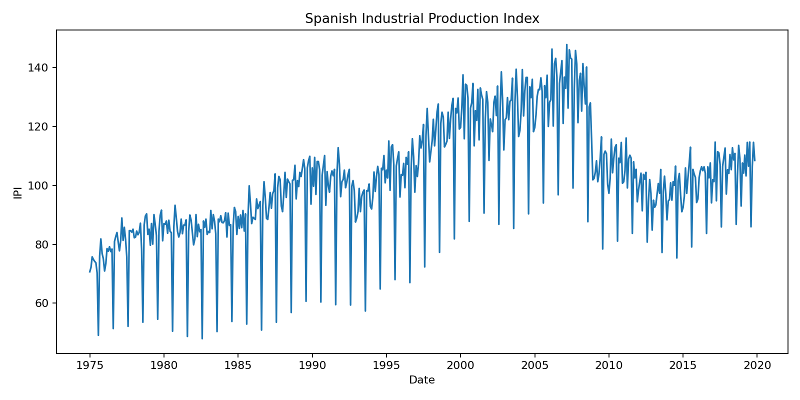
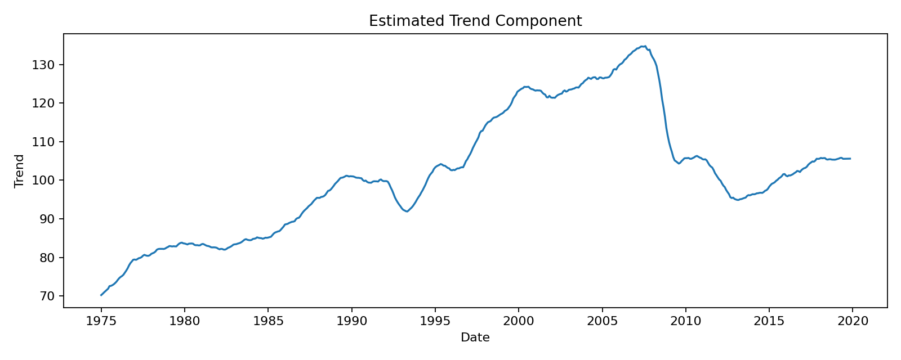
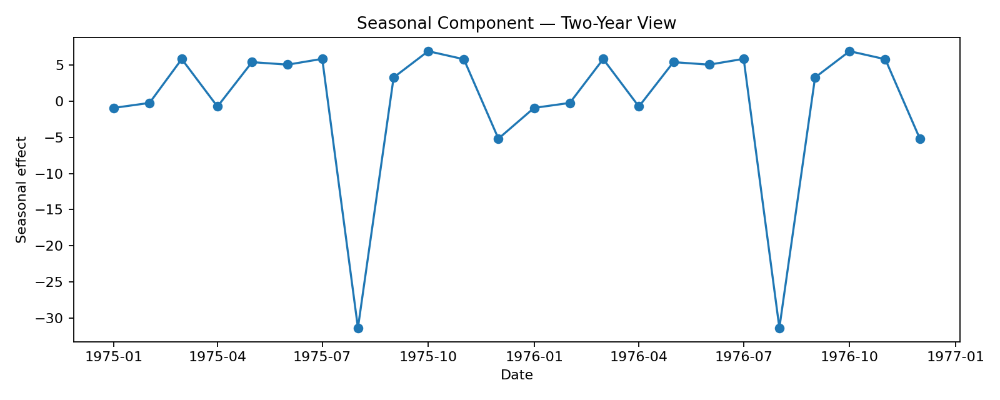
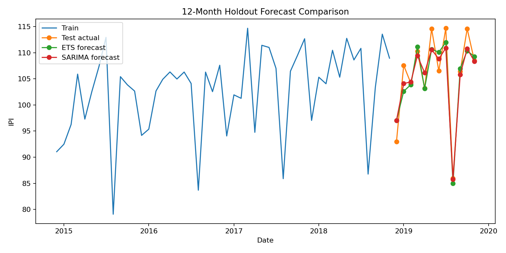
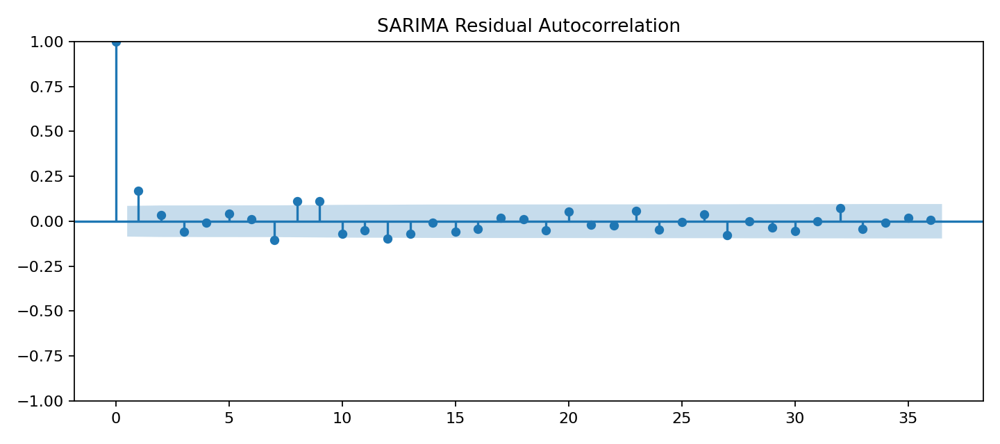

# Industrial Production Time-Series Forecasting

### Monthly forecasting with Exponential Smoothing and Seasonal ARIMA

This project analyzes and forecasts the Spanish **Industrial Production Index (IPI)** using classical univariate time-series methods.

It is a cleaned portfolio reconstruction of a broader predictive-modeling coursework assignment, with particular attention to **stationarity, seasonality, fair train/test design, residual diagnostics and out-of-sample forecasting**.

---

## Project Highlights

- Monthly time series spanning 1975–2019
- Trend and annual-seasonality analysis
- Augmented Dickey–Fuller stationarity testing
- Exponential Smoothing with damped trend and multiplicative seasonality
- Seasonal ARIMA modeling
- Common **12-month TEST horizon** for a fair model comparison
- Forecast evaluation with MAE, RMSE and MAPE
- Explicit Ljung–Box residual diagnostics
- **SARIMA TEST MAPE: 2.06%**
- **ETS TEST MAPE: 2.10%**

---

## Forecasting Problem

Industrial production is observed sequentially through time, so standard random train/test splitting would destroy the temporal structure of the problem.

The forecasting workflow therefore preserves chronology and reserves the final **12 months** as a holdout set.

Using one complete seasonal cycle provides a consistent basis for comparing both models.

---

## Time-Series Structure

The historical series shows both long-term movement and strong recurring annual seasonality.



The ADF test on the level series gives a p-value of **0.3898**, so stationarity is not supported at conventional significance levels.

After differencing, the ADF evidence becomes much stronger.





---

## Model Comparison

| Model | Specification | MAE | RMSE | MAPE |
|---|---|---:|---:|---:|
| Exponential Smoothing | Additive damped trend + multiplicative seasonality | 2.242 | 2.840 | **2.10%** |
| SARIMA | (2,1,1) × (2,0,2,12) | 2.204 | 2.719 | **2.06%** |

Both models perform similarly on the common TEST horizon. SARIMA achieves the lower RMSE and MAPE in this corrected run.



---

## Residual Diagnostics

Forecast accuracy is not the only criterion for a time-series model.

Residuals should ideally behave like white noise, meaning that systematic temporal structure has been removed.

The project therefore uses the **Ljung–Box test** and residual autocorrelation analysis.



Residual autocorrelation remains detectable at seasonal horizons, so the final models are presented with this limitation explicitly documented.

---

## Repository Structure

```text
industrial-production-time-series-forecasting/
├── data/
│   └── README.md
├── images/
│   ├── forecast_comparison.png
│   ├── sarima_residual_acf.png
│   ├── seasonal_component.png
│   ├── series_history.png
│   └── trend_component.png
├── notebooks/
│   └── industrial_production_forecasting.ipynb
├── results/
│   ├── README.md
│   ├── adf_tests.csv
│   ├── model_metrics.csv
│   ├── residual_diagnostics.csv
│   ├── sarima_parameters.csv
│   └── test_forecasts.csv
├── src/
│   ├── __init__.py
│   └── forecasting.py
├── .gitignore
├── README.md
└── requirements.txt
```

---

## Methodological Improvement

The original coursework feedback identified an important validation issue: the forecasting models were not being evaluated with an appropriate and consistent test horizon.

The public portfolio version corrects this by using the **same 12-month holdout** for both ETS and SARIMA.

This makes the model comparison more interpretable and avoids evaluating one method on an unrealistically short or substantially different test period.

---

## Data Policy

The original `IPI_Esp.xlsx` coursework file is **not redistributed** in this public repository.

The public repository contains only code, aggregate diagnostics, forecasts for the final evaluation window and visual results.

---

## Reproducibility

Install dependencies with:

```bash
pip install -r requirements.txt
```

Place the source file at:

```text
data/IPI_Esp.xlsx
```

Then open:

```text
notebooks/industrial_production_forecasting.ipynb
```

---

## Technology Stack

- Python
- pandas
- NumPy
- statsmodels
- pmdarima / auto-ARIMA
- scikit-learn
- Matplotlib
- Jupyter / Google Colab
- Git / GitHub

---

## Limitations

- The analysis is univariate and does not include external economic predictors.
- Structural shocks can reduce the stability of historical seasonal patterns.
- Residual diagnostics indicate remaining autocorrelation at seasonal horizons.
- The source dataset is not redistributed in the public portfolio.
- Forecast performance is evaluated on a single final 12-month holdout.

---

## Author

**Anastasia García Reziapova**

Time-Series Forecasting Project  
Data Science, Big Data & Business Analytics
